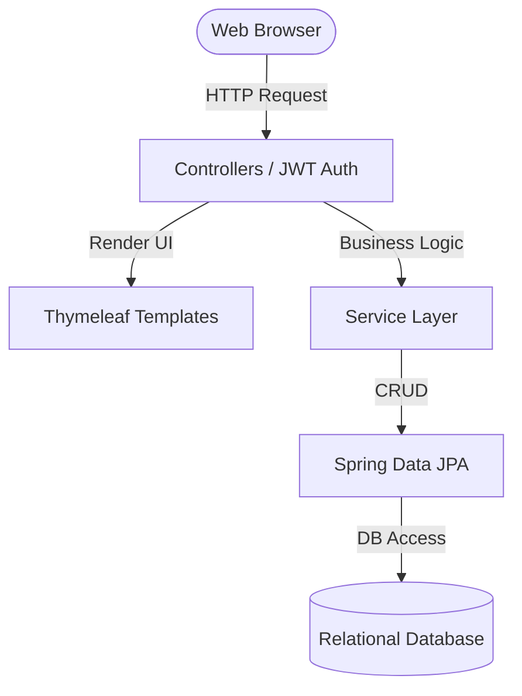
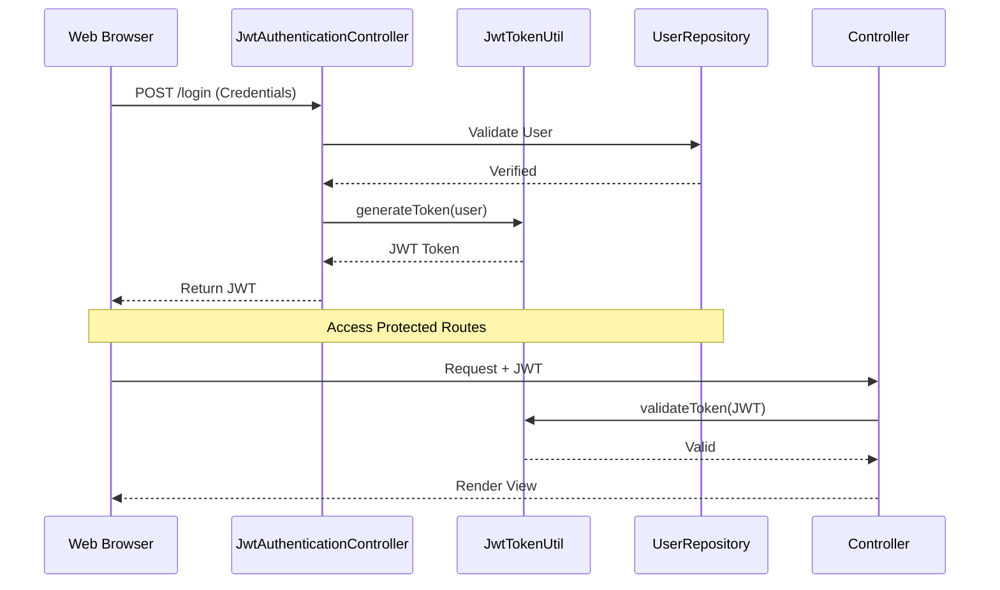

# 🚗 Vehicle Rental Management System

A robust, MVC-based web application built with Spring Boot to manage vehicle rentals.  
The system provides a secure environment for users to register, log in, and manage a fleet of vehicles.

Key highlights:
- Server-Side Rendering (SSR)
- Secure JWT-based authentication
- Structured MVC architecture

---

## 🚀 Local Setup & Installation

---

### 📌 Prerequisites

- Java JDK 11 or higher  
- Maven  
- MySQL or PostgreSQL  
- Git  

---

### 1️⃣ Clone the Repository

```bash
git clone https://github.com/veervanshaj/vehicle_mcv.git
cd vehicle_mcv
```

---

### 2️⃣ Configure Database

Edit `src/main/resources/application.properties`:

```properties
# Example Database Configuration
spring.datasource.url=jdbc:mysql://localhost:3306/vehicle_db
spring.datasource.username=root
spring.datasource.password=your_password
spring.jpa.hibernate.ddl-auto=update
```

> ⚠️ Adjust URL/driver if using PostgreSQL or another DB.

---

### 3️⃣ Build the Application

```bash
mvn clean install
```

---

### 4️⃣ Run the Application

```bash
mvn spring-boot:run
```

OR run the main class:
`VehicleRentalSystemApplication.java`

---

### 5️⃣ Access the Application

| Page                | URL                        |
|---------------------|---------------------------|
| Home / Login        | http://localhost:8080/    |
| Registration Page   | http://localhost:8080/register |

---

## 🏗 System Architecture

### 1️⃣ MVC Data Flow



---

### 2️⃣ JWT Authentication Flow



---

## 🔄 Data Flow & Component Interaction

### 🌐 Client Interface
- Uses Thymeleaf templates (HTML/CSS)
- Server-side rendering for faster load

---

### 🔐 Security Layer
- Managed via `WebSecurityConfig`
- JWT issued on login
- Protected routes require token validation

---

### ⚙️ Controllers
- Handle HTTP requests  
- Example:
  - `VehicleController`
  - `UserController`

---

### 🧠 Service Layer
- Business logic & validations  
- Example:
  - `VehicleService`
  - `UserService`

---

### 🗄 Data Access Layer
- Uses Spring Data JPA  
- Repositories:
  - `VehicleRepository`
  - `UserRepository`

---

## 🛠 Tech Stack & Features

---

### 1️⃣ Frontend: Thymeleaf + HTML/CSS

**Stack:**
- Thymeleaf  
- HTML5  
- CSS  

**Features:**
- Server-side rendering  
- Dynamic dashboards  
- Forms for add/edit vehicle  

---

### 2️⃣ Backend: Spring Boot

**Stack:**
- Java  
- Spring Boot  
- Spring MVC  

**Features:**
- Vehicle CRUD operations  
- User registration & management  

---

### 3️⃣ Security: Spring Security + JWT

**Stack:**
- Spring Security  
- JWT  

**Features:**
- Secure login system  
- Stateless authentication  
- Token-based authorization  
- Custom authentication handler  

---

### 4️⃣ Database & ORM

**Stack:**
- Spring Data JPA  
- Hibernate  

**Features:**
- Automatic schema generation  
- Entity-to-table mapping  
- Reduced boilerplate SQL  

---

## 👨‍💻 Author

**Veer Vanshaj Wadehra**
